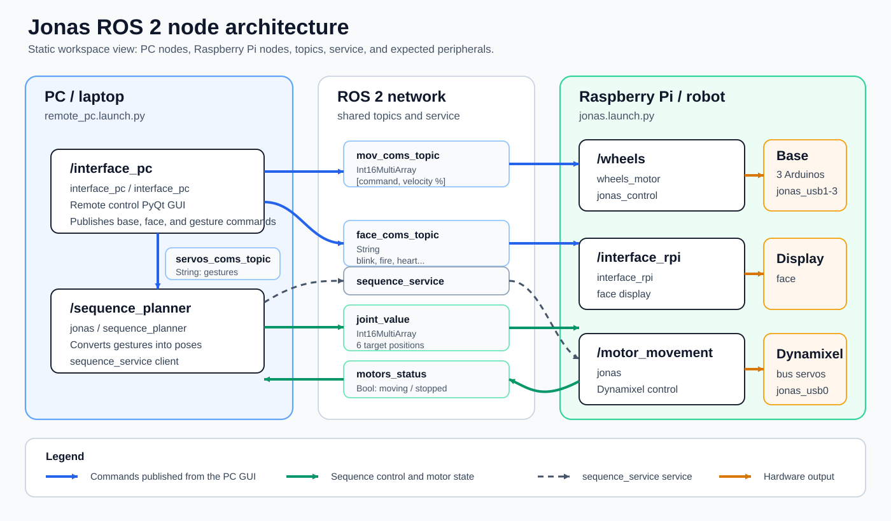
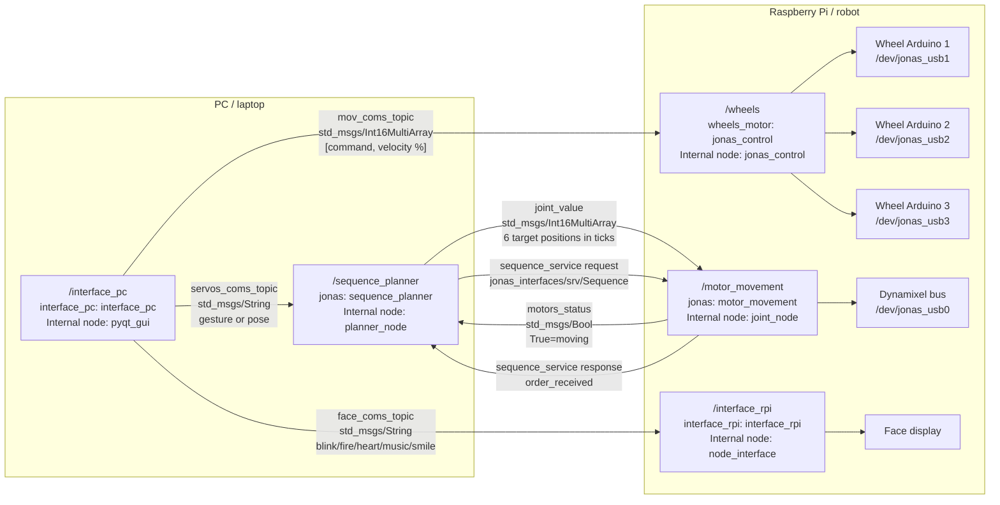

# Jonas Node Architecture

This document was produced from a static inspection of the `jonas_ws` workspace.
It does not require hardware to be connected; it describes the nodes, topics,
services, and expected peripherals defined in the source code.

The Jonas robot software is part of a robotics project of UTEC - Universidad de
Ingenieria y Tecnologia, Lima, Peru. Repository editor and maintainer contact:
`mpuchuri@utec.edu.pe`.

## Overview

The main runtime architecture is split across two machines:

- PC: remote control interface and sequence planner.
- Raspberry Pi: robot hardware control, face display, wheels, and servos.

Main Raspberry Pi launch:

```bash
ros2 launch jonas jonas.launch.py
```

Main PC launch:

```bash
ros2 launch jonas remote_pc.launch.py
```

General diagram:



> The SVG above is the recommended version for previewing the diagram.
> The editable Mermaid version is available below.

<details>
<summary>Show editable Mermaid diagram</summary>



</details>

## PC Nodes

| Launch node | Package / executable | Publishes | Subscribes | Service |
| --- | --- | --- | --- | --- |
| `/interface_pc` | `interface_pc` / `interface_pc` | `mov_coms_topic`, `face_coms_topic`, `servos_coms_topic` | None | None |
| `/sequence_planner` | `jonas` / `sequence_planner` | `joint_value` | `motors_status`, `servos_coms_topic` | Client of `sequence_service` |

Notes:

- `interface_pc` opens a PyQt GUI. If it is run without launch, its internal
  node is named `pyqt_gui`.
- `sequence_planner` receives gestures from the GUI and converts them into
  poses or position sequences for the 6 servos.
- `sequence_planner` waits until `motors_status` reports that the motors have
  stopped before sending the next pose in a sequence.

## Raspberry Pi Nodes

| Launch node | Package / executable | Publishes | Subscribes | Service / hardware |
| --- | --- | --- | --- | --- |
| `/motor_movement` | `jonas` / `motor_movement` | `motors_status` | `joint_value` | Server for `sequence_service`; uses Dynamixel on `/dev/jonas_usb0` |
| `/wheels` | `wheels_motor` / `jonas_control` | None | `mov_coms_topic` | Sends velocities to Arduinos on `/dev/jonas_usb1`, `/dev/jonas_usb2`, `/dev/jonas_usb3` |
| `/interface_rpi` | `interface_rpi` / `interface_rpi` | None | `face_coms_topic` | Displays face animations |

Notes:

- `motor_movement` tries to open the Dynamixel port at startup. Without the
  peripheral connected, that node can fail to start, but the communication
  architecture remains the same.
- `wheels` does not publish ROS topics; it translates movement commands into
  serial velocities for three wheel controllers.
- `interface_rpi` changes the face animation when it receives an expression and
  returns to `blink` after non-continuous animations finish.

## Topics

| Topic | Type | Publisher | Subscriber | Contents |
| --- | --- | --- | --- | --- |
| `mov_coms_topic` | `std_msgs/Int16MultiArray` | PC: `/interface_pc` | RPi: `/wheels` | `data[0]` is the movement command, `data[1]` is velocity percentage |
| `face_coms_topic` | `std_msgs/String` | PC: `/interface_pc` | RPi: `/interface_rpi` | Face expression name |
| `servos_coms_topic` | `std_msgs/String` | PC: `/interface_pc` | PC: `/sequence_planner` | Gesture, pose, or sequence name |
| `joint_value` | `std_msgs/Int16MultiArray` | PC: `/sequence_planner` | RPi: `/motor_movement` | 6 Dynamixel target positions |
| `motors_status` | `std_msgs/Bool` | RPi: `/motor_movement` | PC: `/sequence_planner` | `True` while servos are still moving; `False` when they are done |

Movement command codes used by the GUI:

| Code | Direction |
| --- | --- |
| `1` | `UP` |
| `2` | `DOWN` |
| `3` | `LEFT` |
| `4` | `RIGHT` |
| `5` | `UP-RIGHT` |
| `6` | `DOWN-RIGHT` |
| `7` | `DOWN-LEFT` |
| `8` | `UP-LEFT` |
| `9` | `ROT-LEFT` |
| `10` | `ROT-RIGHT` |

Expected values in `face_coms_topic`:

```text
blink
fire
heart
music
smile
```

Main values sent through `servos_coms_topic` from the GUI:

```text
Salute
Curl
Hug
Dance
Serve
Walking
```

The planner also has internal poses such as `Rest`, `Show`, `Salute 1`,
`Walking 1`, `Dance 1`, `Hug 1`, `Curl 1`, and others.

## Service

| Service | Type | Client | Server | Purpose |
| --- | --- | --- | --- | --- |
| `sequence_service` | `jonas_interfaces/srv/Sequence` | PC: `/sequence_planner` | RPi: `/motor_movement` | Activates motion toward the latest received `joint_value` |

Definition:

```text
bool sequence_active
---
bool order_received
```

The package also contains `jonas_interfaces/action/Sequence.action`, but the
current Python nodes do not create an `ActionServer` or `ActionClient`; the
active flow uses the `sequence_service` service.

## Control Flow

1. The user interacts with `/interface_pc`.
2. To move the base, `/interface_pc` publishes `[command, velocity]` to
   `mov_coms_topic`.
3. `/wheels` receives the message, computes `vx`, `vy`, and `w`, applies inverse
   kinematics, and sends angular velocity to each Arduino.
4. To change the face, `/interface_pc` publishes the expression name to
   `face_coms_topic`.
5. `/interface_rpi` receives the expression and plays images from
   `interface_rpi/faces`.
6. To move arms and servos, `/interface_pc` publishes a gesture to
   `servos_coms_topic`.
7. `/sequence_planner` converts the gesture into one or more poses, publishes
   `joint_value`, and calls `sequence_service`.
8. `/motor_movement` accepts the order, sends positions to the Dynamixel bus,
   and publishes `motors_status`.
9. `/sequence_planner` waits for `motors_status == False` before sending the
   next pose.

## Expected Ports and Peripherals

In the current code:

| Hardware | Port |
| --- | --- |
| Dynamixel / FTDI | `/dev/jonas_usb0` |
| Wheel Arduino 1 | `/dev/jonas_usb1` |
| Wheel Arduino 2 | `/dev/jonas_usb2` |
| Wheel Arduino 3 | `/dev/jonas_usb3` |

The aliases are created by `udev/99-jonas-serial.rules` and installed by
`rpi4_jonas.sh`:

| Hardware | Alias |
| --- | --- |
| Dynamixel / FTDI | `/dev/jonas_usb0` |
| Wheel Arduino 1 | `/dev/jonas_usb1` |
| Wheel Arduino 2 | `/dev/jonas_usb2` |
| Wheel Arduino 3 | `/dev/jonas_usb3` |

This is recommended on the Raspberry Pi because the `ttyUSB0`, `ttyUSB1`, etc.
order can change between reboots.

## Alternative Launch

The file `src/jonas/jonas/launch/new.launch.py` launches:

- `/interface_pc`
- `/wheels`

That launch is useful for local GUI + wheels tests on one machine. It does not
represent the full distributed PC/RPi architecture.

## Useful Commands

Both machines should use the same ROS 2 domain:

```bash
export ROS_DOMAIN_ID=0
export ROS_LOCALHOST_ONLY=0
source /opt/ros/humble/setup.bash
source ~/jonas_ws/install/setup.bash
```

On the Raspberry Pi:

```bash
ros2 launch jonas jonas.launch.py
```

On the PC:

```bash
ros2 launch jonas remote_pc.launch.py
```

To inspect the communication graph while nodes are running:

```bash
ros2 node list
ros2 topic list
ros2 service list
ros2 topic info /mov_coms_topic
ros2 topic info /joint_value
ros2 service type /sequence_service
```
