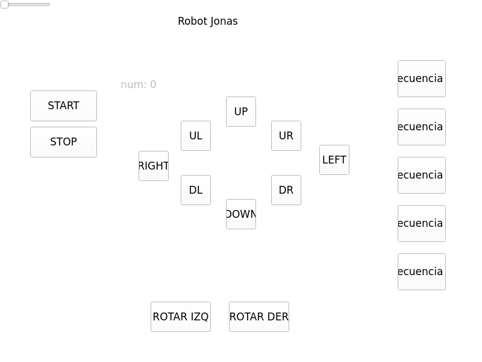

# Jonas ROS 2

This repository contains the ROS 2 Humble software stack for Jonas, a robotics
project of UTEC - Universidad de Ingenieria y Tecnologia, Lima, Peru.

Repository editor and maintainer contact: `mpuchuri@utec.edu.pe`.

## Overview

Jonas is operated through a distributed ROS 2 setup:

- A remote PC runs the operator interface and the arm sequence planner.
- A Raspberry Pi 4 with 8 GB of RAM runs the robot-side nodes for the mobile
  base, face display, and Dynamixel servos.

The workspace is intended to be placed directly at:

```text
~/jonas_ws/src/jonas
```

Keep only this repository inside `~/jonas_ws/src` for Jonas.

## Packages

- `jonas_interfaces`: custom service and action definitions.
- `jonas`: arm motion, Dynamixel control, launch files, and sequence planning.
- `jonas_description`: PC-side URDF/Xacro robot description and RViz
  visualization.
- `wheels_motor`: mobile base control and wheel serial communication.
- `interface_rpi`: robot-side face display interface.
- `interface_pc`: remote PC PyQt control interface.

Additional files:

- `NODE_ARCHITECTURE.md`: node, topic, service, and hardware architecture.
- `docs/jonas_node_architecture.svg`: architecture diagram.
- `rpi4_jonas.sh`: Raspberry Pi setup helper for ROS 2 Humble, runtime
  packages, serial permissions, and udev rules.
- `udev/99-jonas-serial.rules`: stable serial aliases for Jonas hardware.

## PC Control Interface

The `interface_pc` package provides a PyQt GUI for remote operation. It starts a
ROS 2 node named `pyqt_gui` and publishes commands to three topics:



- `mov_coms_topic` (`std_msgs/Int16MultiArray`): mobile base movement command
  and speed percentage.
- `face_coms_topic` (`std_msgs/String`): face expression command for the
  Raspberry Pi display.
- `servos_coms_topic` (`std_msgs/String`): gesture or sequence command for the
  arm sequence planner.

The movement buttons send direction codes for `UP`, `DOWN`, `LEFT`, `RIGHT`,
diagonal motion, and rotation. The horizontal slider sets the movement speed
from `0` to `99`, and the `STOP` button sends a zero-speed command.

The sequence buttons publish both a face expression and an arm gesture:

| Button | Face expression | Arm command |
| --- | --- | --- |
| `Secuencia 1` | `blink` | `Salute` |
| `Secuencia 2` | `fire` | `Curl` |
| `Secuencia 3` | `heart` | `Hug` |
| `Secuencia 4` | `music` | `Dance` |
| `Secuencia 5` | `smile` | `Serve` |

The PC interface is normally launched with:

```bash
ros2 launch jonas remote_pc.launch.py
```

It can also be run directly after building and sourcing the workspace:

```bash
ros2 run interface_pc interface_pc
```

## Robot Description and RViz

The `jonas_description` package contains the current URDF/Xacro model of the
Jonas omni base:

```text
src/jonas/jonas_description/urdf/jonas_omni_base.urdf.xacro
```

This is a PC-side visualization package. It should be built and launched on the
operator PC or development laptop, not on the Raspberry Pi robot runtime. It
launches `robot_state_publisher`, `joint_state_publisher_gui`, and RViz so the
model can be inspected without running the physical robot:

```bash
ros2 launch jonas_description display.launch.py
```

The GUI sliders publish joint states for the continuous wheel joints
`front_wheel_joint`, `left_rear_wheel_joint`, and `right_rear_wheel_joint`.
These sliders let you rotate the visible joints in RViz while the URDF is being
validated.

## Robot Computer Setup

The Jonas robot uses a Raspberry Pi 4 with 8 GB of RAM as its onboard computer.
The base operating system installed on the Raspberry Pi is Ubuntu Server 22.04
LTS. A lightweight graphical desktop was then added with Ubuntu MATE so the
robot-side display tools can run when needed.

Install Ubuntu MATE on top of Ubuntu Server with:

```bash
sudo apt update
sudo apt install -y ubuntu-mate-desktop
sudo reboot
```

During installation, Ubuntu may ask for a display manager. The default option is
usually acceptable. After rebooting, the Raspberry Pi can still be used over SSH,
but it also has a graphical desktop available for local display work.

The same desktop can be installed together with the Jonas setup script by using
the optional `--with-mate` flag.

## Requirements

These instructions target Ubuntu 22.04 with ROS 2 Humble.

On the Raspberry Pi, the recommended setup path is the consolidated helper
script:

```bash
cd ~/jonas_ws
bash src/jonas/rpi4_jonas.sh
```

This installs ROS 2 Humble base, the Python and ROS packages needed by Jonas,
adds the user to the `dialout` group, copies the udev rules from
`src/jonas/udev/99-jonas-serial.rules`, reloads udev, and prepares the shell
environment. The script intentionally excludes PC-only packages such as
`interface_pc` and `jonas_description`; RViz visualization dependencies belong
on the PC.

To also install Ubuntu MATE:

```bash
bash src/jonas/rpi4_jonas.sh --with-mate
```

The manual commands below are useful when setting up a PC or when installing
dependencies step by step.

Load ROS 2 in the current terminal:

```bash
source /opt/ros/humble/setup.bash
export ROS_DISTRO=humble
```

Install base tools:

```bash
sudo apt update
sudo apt install -y \
  python3-colcon-common-extensions \
  python3-rosdep \
  python3-setuptools
```

Initialize `rosdep` if needed:

```bash
sudo rosdep init
rosdep update
```

If `sudo rosdep init` reports that it was already initialized, run only:

```bash
rosdep update
```

Install ROS 2 and Python dependencies used by all packages on a PC or laptop:

```bash
sudo apt update
sudo apt install -y \
  python3-numpy \
  python3-serial \
  python3-pyqt5 \
  python3-tk \
  ros-${ROS_DISTRO}-ament-cmake \
  ros-${ROS_DISTRO}-rosidl-default-generators \
  ros-${ROS_DISTRO}-rosidl-default-runtime \
  ros-${ROS_DISTRO}-action-msgs \
  ros-${ROS_DISTRO}-builtin-interfaces \
  ros-${ROS_DISTRO}-rclpy \
  ros-${ROS_DISTRO}-std-msgs \
  ros-${ROS_DISTRO}-launch \
  ros-${ROS_DISTRO}-launch-ros \
  ros-${ROS_DISTRO}-robot-state-publisher \
  ros-${ROS_DISTRO}-joint-state-publisher-gui \
  ros-${ROS_DISTRO}-rviz2 \
  ros-${ROS_DISTRO}-xacro \
  ros-${ROS_DISTRO}-ament-index-python \
  ros-${ROS_DISTRO}-dynamixel-sdk
```

From the workspace root, install dependencies declared by the local packages:

```bash
cd ~/jonas_ws
rosdep install --from-paths src --ignore-src -r -y
```

On the Raspberry Pi, install only robot-side package dependencies:

```bash
cd ~/jonas_ws
rosdep install --from-paths \
  src/jonas/jonas_interfaces \
  src/jonas/wheels_motor \
  src/jonas/interface_rpi \
  src/jonas/jonas \
  --ignore-src -r -y
```

## Build

For a normal PC or laptop build:

```bash
cd ~/jonas_ws
source /opt/ros/humble/setup.bash
colcon build --symlink-install
source install/setup.bash
```

If package locations were recently moved, clean generated directories first:

```bash
cd ~/jonas_ws
rm -rf build install log
source /opt/ros/humble/setup.bash
colcon build --symlink-install
source install/setup.bash
```

## Raspberry Pi Build

On a Raspberry Pi 4, build only robot-side packages and use a sequential build
to reduce memory pressure:

```bash
cd ~/jonas_ws
source /opt/ros/humble/setup.bash
export MAKEFLAGS="-j1"
COLCON_RPI_ARGS="--symlink-install --merge-install --executor sequential --parallel-workers 1"

colcon build $COLCON_RPI_ARGS \
  --packages-select jonas_interfaces wheels_motor interface_rpi jonas \
  --cmake-args -DBUILD_TESTING=OFF
source install/setup.bash
```

Recommended package-by-package order:

```bash
colcon build $COLCON_RPI_ARGS --packages-select jonas_interfaces --cmake-args -DBUILD_TESTING=OFF
source install/setup.bash

colcon build $COLCON_RPI_ARGS --packages-select wheels_motor --cmake-args -DBUILD_TESTING=OFF
source install/setup.bash

colcon build $COLCON_RPI_ARGS --packages-select interface_rpi --cmake-args -DBUILD_TESTING=OFF
source install/setup.bash

colcon build $COLCON_RPI_ARGS --packages-select jonas --cmake-args -DBUILD_TESTING=OFF
source install/setup.bash
```

The PC-only package `interface_pc` and the visualization package
`jonas_description` are not required on the robot if the Raspberry Pi only runs
`jonas.launch.py`. Build and launch `jonas_description` only on the machine
where RViz will be used.

## Launch

Robot-side launch on the Raspberry Pi:

```bash
ros2 launch jonas jonas.launch.py
```

Remote PC launch:

```bash
ros2 launch jonas remote_pc.launch.py
```

Robot model visualization in RViz on the PC:

```bash
ros2 launch jonas_description display.launch.py
```

For a distributed setup, both machines should share the same ROS 2 domain:

```bash
export ROS_DOMAIN_ID=0
export ROS_LOCALHOST_ONLY=0
```

Source ROS 2 and the workspace on each machine before launching:

```bash
source /opt/ros/humble/setup.bash
source ~/jonas_ws/install/setup.bash
```

## Serial Ports

The current code uses stable udev aliases:

| Hardware | Alias |
| --- | --- |
| Dynamixel / FTDI | `/dev/jonas_usb0` |
| Wheel Arduino 1 | `/dev/jonas_usb1` |
| Wheel Arduino 2 | `/dev/jonas_usb2` |
| Wheel Arduino 3 | `/dev/jonas_usb3` |

The aliases are created by `udev/99-jonas-serial.rules`, which is copied by the
setup script to `/etc/udev/rules.d/99-jonas-serial.rules`. The same rules assign
the devices to the `dialout` group with `0660` permissions.

To manually install the rule:

```bash
sudo install -m 0644 src/jonas/udev/99-jonas-serial.rules /etc/udev/rules.d/99-jonas-serial.rules
sudo udevadm control --reload-rules
sudo udevadm trigger --subsystem-match=tty
sudo usermod -aG dialout $USER
```

Log out and back in, or reboot, so the group change takes effect.
